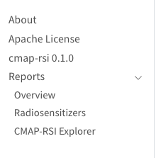

# Page Ordering in Quarto Websites
A small thing, but something that's been incorporated into my development. Sometimes a directory of reports that turn into a website are not in the order I'd like them to be (logical progression of ideas). 

Take, for instance, the small project I just finished:
```
- CMAP-RSI_Explorer.qmd
- Overview.qmd
- Radiosensitizers.qmd
```

As luck would have it, `Overview` comes alphabetically before `Radiosensitizers` but `CMAP-RSI_Explorer` should be the last thing on the list (after reading the reports). 

To change the order, you can edit the quarto document and include the `order` tag in the yml header:

```yml
title: "CMAP-RSI Explorer"
order: 3
```

This way, I can ensure a logical progression:
