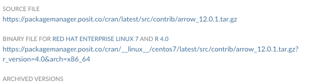

# Using Arrow with Shiny
Many of my shiny apps follow a very specific recipe: load data, show various representations (tables, figures) of the data, allow user to download the data. A recurring issue with this setup is that if the data is at all big, there can be a delay getting things started.

Enter the [Arrow Package](https://arrow.apache.org/docs/r/). An Apache project, it focuses on column-oriented data and making it portable and fast. For our purposes, it allows for much faster load times for data objects from disk. This post is how to incorporate it into a shiny app.

The process is simple: 
- create a "feather" file containing the object
- read the object into an R/Shiny session

## Arrow (without Shiny)
### Installing the arrow package
Before we can use the arrow package, we have to install it. Note that this is usually easy (e.g., CRAN):
```r
install.packages("arrow")
```
See a bit further below on a binary installation (which I needed for a shiny server limitation).

### Creating an arrow file
Let's assume we have an object `x` which is a data frame (or tibble). Arrow does all of the work for us, so we just save it to a file using arrow-specific code:
```r
arrow::write_feather(x, here::here("data/cmap.arrow"))
```
It appears that the preference is for ending files as `.arrow` (I read that somewhere but cannot find the reference now). The feather format is apparently arrow v2, so appears to be an alias.

### Loading an arrow file
Since the arrow package does all the work, we just load and go:
```r
x <- arrow::read_feather("data/cmap.arrow")
# Example dplyr function
dplyr::arrange(x, name)
```

## Arrow (with Shiny)
In the simplest case, incorporating arrow into shiny involves converting the existing object to arrow (by writing it out using `arrow::write_feather()`). My mileage varied, so below are some problems and solutions.

### Installing Arrow
I was on a system that did not have a C17 compiler installed and I did not have root access to install one. However, this offered me the opportunity to learn how to install binary packages.

First, figure out what R version and what OS you are using (I knew I was in a redhat-like OS - `lsb_release -a` for debian-like OS):
```sh
R --version
cat /etc/redhat-release
```

The Posit package manager provides binary versions of packages (https://packagemanager.posit.co/client/#/). I selected the cran R Repos, RHEL7 OS, and found the arrow package. Towards the bottom of the page, there is a section for "Binary File..". 



Perfect! Now I can run wget on the shiny server to retrieve the tarball:

```sh
wget https://packagemanager.posit.co/cran/__linux__/centos7/latest/src/contrib/arrow_12.0.1.tar.gz?r_version=4.0&arch=x86_64 -O arrow_12.0.1.tar.gz
```
and install the package inside of R within my personal library.
```r
install.packages("arrow_12.0.1.tar.gz", repos=NULL)
```

### Using Arrow in Shiny
Of course, I'm not quite done. I need the R process to read from my local library (in addition to the system library). There are a few ways I've seen (including a .Rprofile). For me, it was easiest to add this to the top of the shiny `app.R` file.

```r
.libPaths(c("/home/me/R/x86_64-pc-linux-gnu-library/4.0",.libPaths()))
```

This will have shiny use my personal library for the app. 

## Shiny and Arrow
With all of the above done, I was able to incorporate arrow into my shiny app very simply:

```r
cmap_table <- dplyr::select(
  arrow::read_feather("cmap.arrow"),
  cmap_name, cell2, vehicle_rsi,perturbation_rsi,deltaRSI, dplyr::everything()
)
```

(note the lack of a pipe since it's 4.0.5 without the builtin pipe and I didn't want to verify magrittr would work).