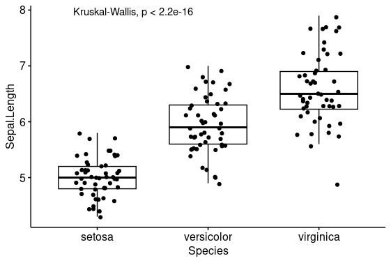
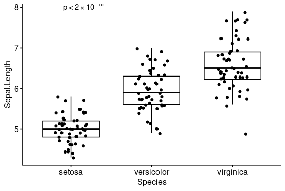

As part of a page proof request, a boxplot with the `ggpubr` package was flagged as needing exponential notation for the small pvalues (e.g., `1x10^-4` vs `1e-04`). That seemed easy. And it was, after a long battle with expressions, bquote, and other R concepts...

# Getting Started
I had used the excellent `ggpubr` package for a boxplot with points (using `add="jitter"`) and a wilcoxon test of differences using `stat_compare_means()`. Something equivalent to:

```r
ggpubr::ggboxplot(
    iris,
    x="Species",
    y="Sepal.Length",
     add="jitter"
) + 
    ggpubr::stat_compare_means()
```
which generates:


So if I can switch from p < 2.2e-16 to p < 2.2<sup>-16</sup> I'd be in good shape.

# First Step
To get the p value in different format, it looked like I would need the following:

```r
ggpubr::stat_compare_means(
    ggplot2::aes(
        label = do_something(
            ggplot2::after_stat(p.format)
        ),
    parse = TRUE
)
```

This actually consists of two different concepts which took me a while to figure out (both of them). 

## after_stat
The easiest was that I had to change the aesthetics for the `compare_means` function call. Notice that I have a magic function `do_something()` that I haven't figured out yet. But it will eventually format the p value to what I need. The magic of `ggplot2::after_stat(p.format)` is actually the way to get the calculated p values to do something with them. As should be obvious, `p.format` would be the formatted p value. Except nothing is ever completely obvious. Most of the time it is the numerical p value as string unless the p value is very small. Then it becomes `<2e-16` (for instance). But either way, I can get the computed p value and format it how I'd like.

## plotmath
The second piece is the `parse=TRUE`. There is a whole universe of using math notation (like latex) within graphs in R. This is called `plotmath` and is definitely worth knowing. Lots of nice math layout is possible using this approach.

But, when using `plotmath` the goal is to pass expressions (like 10^2) which can be then evaluated and rendered appropriately. The ggplot family of things make like easier by having a parameter `parse=TRUE` that can be passed along with the strings that represent the expressions. This allows us to use notation like `10^2` which would render 10<sup>2</sup>. 

# A solution
Given this setup, I just need a `do_something()` that would create a parseable string representing a plotmath function. I've seen several [stackexchange](https://stackoverflow.com/questions/71396750/how-to-print-p-values-with-exponent-scientific-notation) posts about this:

```r
gsub("e", " %*% 10^", pvalue)
```
This cleverly replaces the `e` with `x 10^`, meaning you get the correctly formatted p value in plotmath format.

Therefore, 
```r
do_something <- function(x) {
   paste0(
        "p ",
        ifelse(
            startsWith(x, "<"), 
            "",
            "== "
        ),
        gsub("e", " %*% 10^",x)
    )
}
```
Note that the code here is vectorized, since the labels can be numerous if the figure is faceted. Also note that it handles the `< val` or `val` approach.

Putting it together,
```r
do_something <- function(x) {
   paste0(
      "p ",
      ifelse(startsWith(x, "<"), "","== "),
      gsub("e", " %*% 10^",x)
    )
}
ggpubr::ggboxplot(
  iris, 
  y= "Sepal.Length",
  x="Species",
  add="jitter"
) +
  ggpubr::stat_compare_means(
    ggplot2::aes(
        label=do_something(
            ggplot2::after_stat(p.format)
        )
    ),
    parse = TRUE
  )
```

The result is:


(Note: The p value is slightly cutoff, but you can add `vjust=1` to the call to adjust it slightly downward).